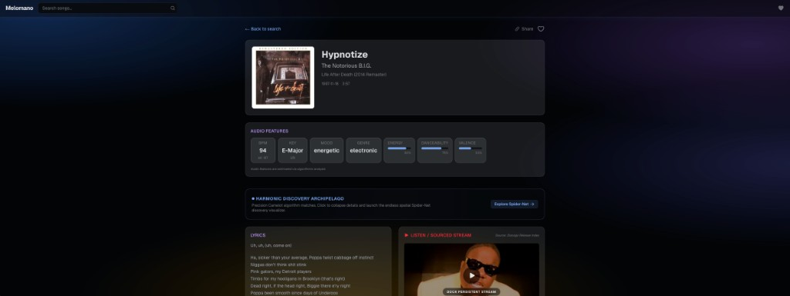

# Melomano

[](https://github.com/noko32/deglosser/actions/workflows/ci.yml)

**Search any song. Get lyrics, BPM, key, credits, samples, and album art — all on one page.**

[melomano.dev](https://melomano.dev)



## About

Finding complete information about a song — lyrics, BPM, musical key, writing credits, sample relationships, album art — requires searching many different sites. Melomano aggregates free music APIs into a single streaming page, then goes further with **Spider-Net**: Camelot-compatible harmonic discovery so you can explore related tracks without leaving the song view.

## Features

- **Search** — iTunes Search results, resolved to a MusicBrainz recording (MBID) for the song page
- **Lyrics** — LRCLIB with exact match + fuzzy fallback (88%+ hit rate on mainstream songs)
- **Audio features** — BPM, key, energy, danceability, mood, genre via FreqBlog
- **Credits** — Writers and producers from MusicBrainz + supplemental credits (mastering, photography, etc.) from Discogs
- **Sample relationships** — "samples" and "sampled by" from MusicBrainz work-level relations
- **Album art** — Cover Art Archive first, with iTunes / Discogs fallbacks, shimmer loading, and gradient placeholder
- **Spider-Net** — Camelot-compatible neighbors in an exploratory graph on the song page (denser when more songs with BPM/key are cached)
- **YouTube** — Discogs-sourced videos with a persistent global drawer player
- **Streaming UI** — Core MusicBrainz data first, then parallel sources each in their own Suspense boundary. Fast data appears in ~0.4s; full page in ~2.5s cold, <100ms cached
- **Favorites & recent searches** — localStorage-based, no sign-up required
- **Dynamic OG images** — Per-song 1200x630 cards with album art, generated via Satori
- **Postgres caching** — Aggregated song data cached in Neon; repeat lookups skip all API calls

| | |
|---|---|
|  |  |

## Tech Stack

- [Next.js 16](https://nextjs.org/) – framework (App Router, Server Components)
- [React 19](https://react.dev/) – UI
- [TypeScript](https://www.typescriptlang.org/) – language
- [Tailwind CSS v4](https://tailwindcss.com/) – styling
- [Neon Postgres](https://neon.tech/) – database
- [Drizzle ORM](https://orm.drizzle.team/) – query builder
- [Vitest](https://vitest.dev/) – testing
- [GitHub Actions](https://github.com/features/actions) – CI
- [Vercel](https://vercel.com/) – deployment

## Getting Started

```bash
git clone https://github.com/noko32/deglosser.git
cd deglosser
npm install
cp .env.example .env.local
# Fill in your API keys (see below)
npm run dev
```

### Environment Variables

| Variable | Required | Description |
|----------|----------|-------------|
| `DATABASE_URL` | Yes | Neon Postgres connection string |
| `FREQBLOG_API_KEY` | Yes | [FreqBlog](https://freqblog.com) API key (free tier: 1k requests/mo) |
| `DISCOGS_TOKEN` | Yes | [Discogs developer token](https://www.discogs.com/settings/developers) (free: 60 req/min) |
| `NEXT_PUBLIC_SITE_URL` | No | Base URL for OG tags (defaults to `https://melomano.dev`) |
| `NEXT_PUBLIC_CLERK_PUBLISHABLE_KEY` | No | Clerk auth (app works without it) |
| `CLERK_SECRET_KEY` | No | Clerk auth (app works without it) |

## Populate the cache (Spider-Net density)

Spider-Net recommendations work best when Neon already holds many songs with BPM and key. Warm the cache with a curated seed set (artist/title list lives in the script — not listed here):

```bash
npm run cache:warm
```

This runs each seed track through iTunes → MBID resolve → MusicBrainz + FreqBlog + lyrics + Discogs, then writes Postgres. Tracks that already have BPM and key cached are skipped. Expect several minutes: the script throttles ~1.5s between tracks to stay polite with upstream APIs.

**Notes:** Requires a valid `.env.local` (same keys as local dev). Uses FreqBlog and Discogs quota — avoid running repeatedly on a free tier unless you need a refill. Safe to re-run after partial failures.

## Testing

```bash
npm test          # Run all 59 tests
npx vitest --ui   # Interactive test UI
```

Tests cover the pure business logic in `src/lib/`: iTunes resolve helpers, release selection heuristics, credit extraction, fuzzy lyric matching, format normalization, and API response mapping. Each API wrapper has mocked-fetch tests for success, failure, and edge cases.

## Note on Repo Name

This project was originally scaffolded as "deglosser" and later rebranded to Melomano. The GitHub repository name reflects the original scaffold name.
