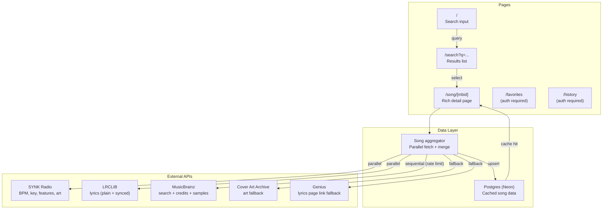

# PD: Deglosser — Song Information Aggregator (Parent)

## Goal

Build a full-stack song information aggregator that lets you search any song and see lyrics, BPM, key, credits, sample relationships, and album art on one clean page — pulling from multiple free APIs into a unified experience that doesn't exist elsewhere.

## Anatomy

### Key observations

- **MusicBrainz** is the backbone: provides search, recording IDs (MBIDs), release info, and the recording→work→artist-rels chain for credits. Rate limited to 1 req/sec.
- **SYNK Radio API** (`api.synkradio.co.uk`) is a surprise powerhouse: returns BPM, key, energy, danceability, valence, cover art, label, genre, and recommendations — all from a single `GET /track/info?title=X&artist=Y` with no API key. Risk: parent service shut down, API still running.
- **LRCLIB** (`lrclib.net/api`) provides plain + time-synced lyrics for free, no key. Tested 4/4 mainstream hits (English + Spanish).
- **Cover Art Archive** is the fallback for album art when SYNK doesn't have the track. Keyed by MusicBrainz Release MBID.
- **Genius** is the last-resort fallback: link to the lyrics page (not inline lyrics) when LRCLIB misses.
- **Credits require 3 sequential MB calls:** search → recording (inc=work-rels) → work (inc=artist-rels). ~2.5s worst case. Must be cached.
- **The core value prop:** No free consumer-facing product combines lyrics + BPM/key + credits + samples + art on one page.

### Files involved (planned)

| Directory | Purpose |
|-----------|---------|
| `src/app/` | Pages (search, song detail, favorites, history) |
| `src/lib/` | API wrappers (musicbrainz, synk, lrclib, cover-art), DB client, aggregator |
| `src/components/` | UI components (search bar, song card, lyrics display, audio features) |
| `src/db/` | Drizzle schema + migrations |
| `src/actions/` | Server actions (search, favorite, etc.) |

## Assumptions & Confirmations

**Assumption 1:** AcousticBrainz can provide BPM/key data.
**Debunked:** Shut down data collection in 2022. Cannot be relied upon.

**Assumption 2:** Genius API returns lyrics content directly.
**Debunked:** Only returns song page URLs and metadata. Lyrics require scraping (ToS violation).

**Assumption 3:** "SampleBrainz" is a separate service.
**Debunked:** Doesn't exist. Sample relationships are part of MusicBrainz's "samples material" relationship type.

**Assumption 4:** There's no free lyrics API with actual lyric text.
**Debunked:** LRCLIB is free, no key, returns plain + synced lyrics. Tested successfully.

**Assumption 5:** Spotify can fill the BPM/key gap.
**Debunked:** As of Feb 2026, requires 250K MAU for audio-features access.

**Assumption 6:** No "all-in-one" song info aggregator exists.
**Partially debunked:** Credits.fm (credits only), SYNK Radio API (raw API, not consumer), Musicfetch (links only). None combine lyrics + BPM + credits + samples + art in one consumer product.

**Assumption 7:** The value prop of aggregation is strong.
**Confirmed:** The gap is real. Differentiator is the experience of the page itself.

## 5 Majors

1. **Can LRCLIB reliably return lyrics for mainstream songs (>80% hit rate)?**
   - YES. Tested 4/4: Kendrick Lamar, Bad Bunny, Taylor Swift, Daft Punk. All returned full lyrics with synced timestamps.
   - Fallback: link to Genius page if LRCLIB misses.

2. **Can we aggregate from 3-4 APIs within <3s for the song detail page?**
   - YES with caching. First load ~2.5s (MusicBrainz chain dominates). SYNK + LRCLIB are parallel and fast (<500ms each). Postgres caching makes repeat lookups <100ms. Progressive loading UX shows fast data first.

3. **Does MusicBrainz have sufficient credits/samples coverage?**
   - PARTIAL. Tested HUMBLE. — got writers (Kendrick Duckworth, Mike WiLL Made-It). Coverage varies by song; community-curated. Show "not available" gracefully when missing.

4. **Can BPM/key source (SYNK Radio) be relied on for MVP?**
   - YES for now. Tested successfully. Architected as optional enrichment — page works without it. Fallback: omit audio features section.

5. **Is Clerk + Neon + Drizzle the right stack for 3-week timeline?**
   - YES. All have generous free tiers, good docs, fast setup. De-risk: build core loop (search→detail) first in Week 1, add auth in Week 2.

## Experiments / Prototypes

### Experiment 1: LRCLIB lyrics coverage

**Hypothesis:** LRCLIB covers mainstream songs across genres.
**Method:** GET requests for 4 diverse songs (hip-hop EN, reggaeton ES, pop EN, electronic EN).
**Result:** PASS. 4/4 returned full lyrics + synced timestamps. Spanish worked perfectly.

### Experiment 2: MusicBrainz credits chain

**Hypothesis:** search → recording → work → artist-rels gives us writers/producers.
**Method:** Searched "Kendrick Lamar HUMBLE", followed the chain through 3 API calls.
**Result:** PASS. Got writers: Kendrick Duckworth + Michael Williams II (Mike WiLL Made-It). Requires 3 sequential calls.

### Experiment 3: Cover Art Archive

**Hypothesis:** Album art accessible via release MBID from search results.
**Method:** Used MBID from search, hit `/release/{mbid}` on coverartarchive.org.
**Result:** PASS. Returns thumbnails at 250/500/1200px.

### Experiment 4: SYNK Radio API

**Hypothesis:** Free BPM/key/features by artist+title, no key needed.
**Method:** GET `api.synkradio.co.uk/track/info?title=HUMBLE&artist=Kendrick Lamar`
**Result:** PASS (exceeds expectations). Returns BPM (150), key (C#/Db Minor), energy, danceability, valence, cover art, label, genre, ISRC, UPC, and 5 recommendations.

### Experiment 5: End-to-end latency

**Hypothesis:** Full page data fetchable within 3s.
**Method:** Traced required calls — SYNK and LRCLIB parallel (~400ms), MusicBrainz sequential chain (~2.5s with rate limit).
**Result:** PASS. ~2.5s worst case first load. Progressive loading shows fast data immediately. Cached repeat loads <100ms.

## Root Cause

No free, consumer-facing web product aggregates lyrics, BPM/key, credits, sample relationships, and album art into a single clean song page — the data exists across 4+ APIs but nobody has unified it with good UX.

## Solution Proposal

Build Deglosser as a Next.js 16 App Router application. Tech stack: TypeScript, Neon Postgres, Drizzle ORM, Clerk auth, Tailwind CSS v4, Vercel hosting, GitHub Actions CI.

### API sources (validated):

| Source | Role | Key? | Reliability |
|--------|------|------|-------------|
| LRCLIB | Lyrics (plain + synced) | No | High |
| SYNK Radio | BPM, key, audio features, cover art, recommendations | No | Medium (parent service shut down) |
| MusicBrainz | Search, metadata, credits, samples | No (User-Agent) | Very high |
| Cover Art Archive | Album art fallback | No | Very high |
| Genius | Lyrics page link fallback | OAuth client token | High |

### Child PDs:

| PD | Scope |
|----|-------|
| PD-Deglosser-1 | Scaffold + Search (project setup, MB search, results page) |
| PD-Deglosser-2 | Song Detail Page + API Aggregation (core page, data merging, caching) |
| PD-Deglosser-3 | Lyrics Display (LRCLIB integration, synced scrolling, fallbacks) |
| PD-Deglosser-4 | Auth + User Features (Clerk, favorites, search history) |
| PD-Deglosser-5 | Polish + CI + Ship (UI polish, tests, GitHub Actions, deploy) |

### Timeline:

- Week 1 (Days 1-5): PD-1 + PD-2
- Week 2 (Days 6-10): PD-3 + PD-4
- Week 3 (Days 11-15): PD-5

### Risk mitigations:

- SYNK down → audio features optional, Cover Art Archive for art
- LRCLIB miss → "Lyrics not available" + Genius link
- MusicBrainz credits sparse → show gracefully, link to contribute
- First-load latency → progressive loading + Postgres cache
